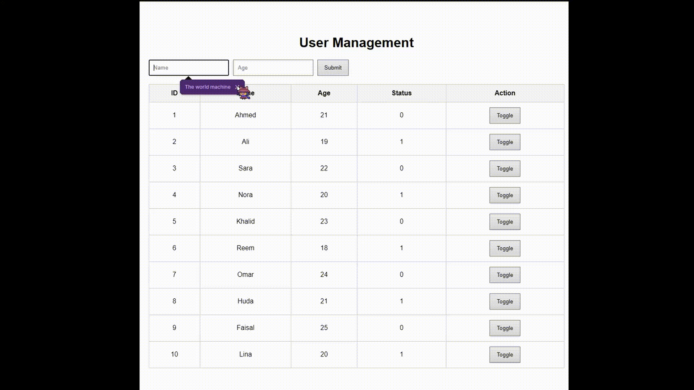

# Simple Database

A simple database management webpage developed as part of a web development training task. The project demonstrates how user records can be added, displayed in a table, and managed through a status toggle system.

## Features

- Add users using Name and Age fields
- Display records in a table
- Toggle status values between 0 and 1
- Simple user-friendly interface
- Demonstrates basic database management concepts

## Technologies Used

- HTML
- CSS
- JavaScript
- PHP
- MySQL

## Project Structure

```text
simple_database/
│
├── index.php
├── style.css
├── script.js
├── database.sql
├── README.md
└── demo.gif
```

## How It Works

1. Enter a user's name.
2. Enter the user's age.
3. Click Submit.
4. The new record appears in the table.
5. Click Toggle to switch the status value between 0 and 1.
6. The table updates immediately.

## Demonstration



## Learning Objectives

This project was created to practice:

- Form creation
- Table management
- JavaScript interactions
- PHP integration
- MySQL database concepts
- Status updating functionality

## Author

**V**

Smart Methods Training – Week 2
